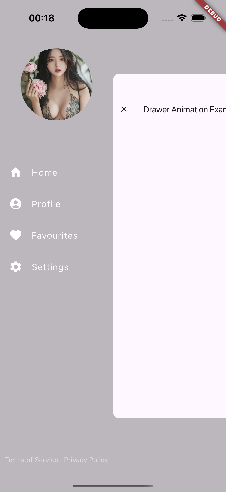
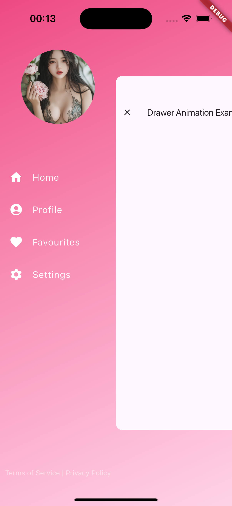
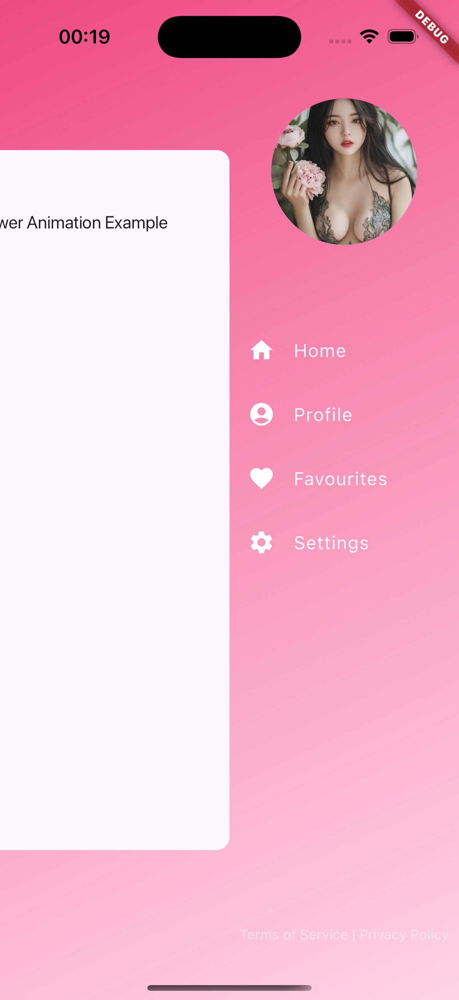
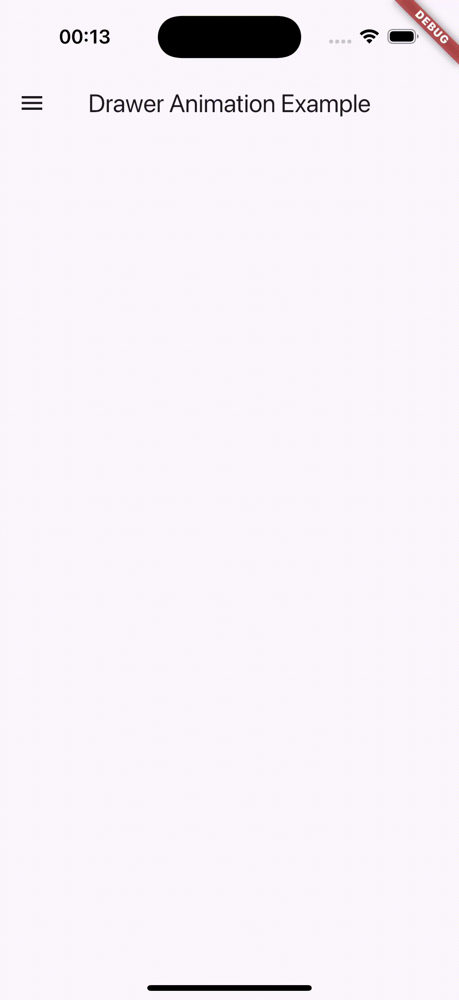

# Drawer Transition

A Flutter package that provides a customizable drawer with smooth animations, scale transitions, and a modern navigation pattern. This implementation offers a comprehensive solution for creating animated drawers with built-in content management.

## Preview

<table>
  <tr>
    <td align="center">Default drawer</td>
    <td align="center">Custom backdrop</td>
    <td align="center">RTL support</td>
  </tr>
  <tr>
    <td></td>
    <td></td>
    <td></td>
  </tr>
</table>

<div>
  <a href="screenshot/5.mp4">
    
  </a>
</div>

## Features

* 🎨 Fully customizable drawer with built-in content management
* ✨ Smooth animations with scale and slide transitions
* 📱 Gesture support with drag to open/close
* 🔄 RTL support
* 🎯 Theme-aware styling
* 🎭 Custom backdrop support
* 🎮 Controller for programmatic control
* 🛡️ Safe area support
* 📍 Built-in navigation state management
* 🖼️ Header and footer customization

## Getting started

Add this to your package's `pubspec.yaml` file:

### From pub.dev

```yaml
dependencies:
  drawer_transition: ^0.0.1
```

### From Git repository

```yaml
dependencies:
  drawer_transition:
    git:
      url: https://github.com/vanh6803/drawer_transition
      ref: main
```

### From local path

```yaml
dependencies:
  drawer_transition:
    path: /path/to/drawer_transition
```

## Imports

Add the following imports to your file:

```dart
// Main package import
import 'package:drawer_transition/drawer_transition.dart';

// Individual imports if needed
import 'package:drawer_transition/src/controller.dart';
import 'package:drawer_transition/src/drawer_content.dart';
import 'package:drawer_transition/src/drawer_item.dart';
import 'package:drawer_transition/src/value.dart';
import 'package:drawer_transition/src/widget.dart';
```

Note: Typically, you only need the main package import:
```dart
import 'package:drawer_transition/drawer_transition.dart';
```

This gives you access to:
- `DrawerTransition` widget
- `DrawerTransitionController`
- `DrawerTransitionValue`
- `DrawerContent`
- `DrawerItem`
- `DrawerListTile`

## Usage

### Basic Usage with Navigation

```dart
final drawerController = DrawerTransitionController();
final selectedIndex = ValueNotifier<int>(0);

final items = [
  DrawerItem(icon: Icons.home, title: 'Home'),
  DrawerItem(icon: Icons.person, title: 'Profile'),
  DrawerItem(icon: Icons.settings, title: 'Settings'),
];

DrawerTransition(
  controller: drawerController,
  drawer: DrawerContent(
    items: items,
    selectedIndex: selectedIndex,
    onDrawerClose: drawerController.hideDrawer,
    header: YourHeaderWidget(),
    footer: YourFooterWidget(),
  ),
  child: Scaffold(
    appBar: AppBar(
      leading: IconButton(
        onPressed: drawerController.toggleDrawer,
        icon: Icon(Icons.menu),
      ),
    ),
    body: ValueListenableBuilder<int>(
      valueListenable: selectedIndex,
      builder: (context, index, _) {
        return YourPages[index];
      },
    ),
  ),
);
```

### Custom Drawer Items

```dart
final items = [
  // Basic item with icon and title
  DrawerItem.basic(
    icon: Icons.home,
    title: 'Home',
  ),
  
  // Custom item with widgets
  DrawerItem.custom(
    leading: CircleAvatar(
      child: Icon(Icons.person),
    ),
    titleWidget: Column(
      crossAxisAlignment: CrossAxisAlignment.start,
      children: [
        Text('Profile'),
        Text('Admin', style: TextStyle(fontSize: 12)),
      ],
    ),
    trailing: Badge(
      child: Icon(Icons.notifications),
    ),
  ),
  
  // Fully custom item using builder
  DrawerItem.builder(
    builder: (context, isSelected) {
      return ListTile(
        selected: isSelected,
        selectedColor: Colors.black,
        selectedTileColor: Colors.black.withOpacity(0.4),
        leading: Icon(Icons.favorite),
        title: Text('Favorites'),
        trailing: Icon(Icons.arrow_forward_ios),
      );
    },
  ),
];
```

### Advanced Customization

```dart
DrawerTransition(
  backdrop: Container(
    decoration: BoxDecoration(
      gradient: LinearGradient(
        colors: [Colors.blue.withOpacity(0.8), Colors.purple.withOpacity(0.2)],
      ),
    ),
  ),
  openRatio: 0.7,
  openScale: 0.8,
  animationCurve: Curves.easeInOut,
  animationDuration: Duration(milliseconds: 300),
  childDecoration: BoxDecoration(
    borderRadius: BorderRadius.circular(16),
  ),
  drawer: DrawerContent(
    selectedColor: Colors.amber,
    selectedTileColor: Colors.amber.withOpacity(0.2),
    contentPadding: EdgeInsets.symmetric(horizontal: 24, vertical: 8),
    shape: RoundedRectangleBorder(
      borderRadius: BorderRadius.circular(12),
    ),
    // ... other properties
  ),
);
```

## Properties

### DrawerTransition Properties

| Property | Type | Description |
|----------|------|-------------|
| `child` | Widget | The main content of your app |
| `drawer` | Widget | The drawer content that slides in |
| `controller` | DrawerTransitionController? | Controller to manage drawer state |
| `backdrop` | Widget? | Custom backdrop widget |
| `backdropColor` | Color? | Color of backdrop when drawer is open |
| `openRatio` | double | How much of the screen the drawer should occupy (0.0 to 1.0) |
| `openScale` | double | Scale factor for main content when drawer is open |
| `animationDuration` | Duration | Duration of the open/close animation |
| `animationCurve` | Curve? | Animation curve to use |
| `childDecoration` | BoxDecoration? | Decoration for the main content container |
| `rtlOpening` | bool | Whether drawer should open from right-to-left |
| `disabledGestures` | bool | Whether to disable gesture controls |

### DrawerContent Properties

| Property | Type | Description |
|----------|------|-------------|
| `items` | List<DrawerItem> | List of drawer items |
| `selectedIndex` | ValueNotifier<int> | Controls the selected item state |
| `onDrawerClose` | VoidCallback | Callback when drawer should close |
| `header` | Widget? | Optional header widget |
| `footer` | Widget? | Optional footer widget |
| `selectedColor` | Color? | Color for selected item text/icon |
| `selectedTileColor` | Color? | Background color for selected item |
| `contentPadding` | EdgeInsetsGeometry? | Padding for list items |
| `textColor` | Color? | Default text color |
| `iconColor` | Color? | Default icon color |

### DrawerItem Constructors

| Constructor | Description |
|------------|-------------|
| `DrawerItem.basic()` | Create item with icon and title |
| `DrawerItem.custom()` | Create item with custom leading, title and trailing widgets |
| `DrawerItem.builder()` | Create fully custom item with builder function |

### DrawerItem Properties

| Property | Type | Description |
|----------|------|-------------|
| `icon` | IconData? | Icon for basic item |
| `title` | String? | Title text for basic item |
| `leading` | Widget? | Custom leading widget |
| `titleWidget` | Widget? | Custom title widget |
| `trailing` | Widget? | Custom trailing widget |
| `builder` | Widget Function(BuildContext, bool)? | Builder function for full customization |


## Notes

- Remember to dispose of controllers when they're no longer needed
- The drawer content uses theme colors by default but can be overridden
- BoxShadow in childDecoration might cause animation jerks
- For optimal performance, heavy content should be wrapped with RepaintBoundary

## Issues and Feedback

Please file issues and feedback using the Github issue tracker: [issues](https://github.com/vanh6803/drawer_transition)

## Contributing

Contributions are welcome! Please feel free to submit a Pull Request.
